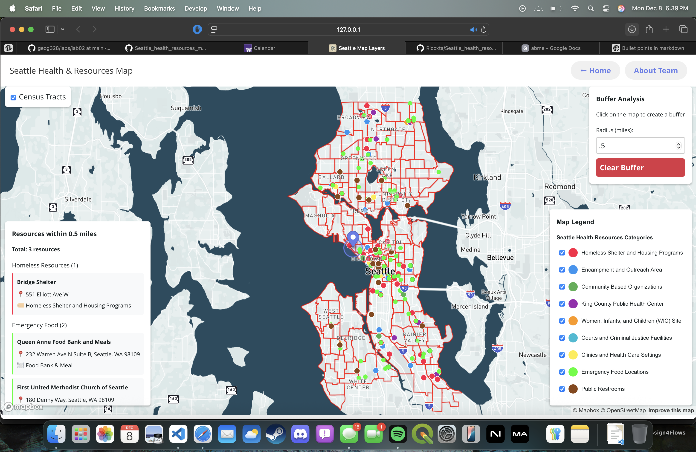

## Seattle Health Resources Map

### Project Description
The Seattle Health Resources Map is an interactive, web-based mapping application that we developed to help users explore the distribution of health-related resources across the city of Seattle. The site is built with HTML, CSS, and JavaScript and functions entirely as a static website hosted on GitHub Pages.
Our goal in creating this application was to take publicly available data and translate it into a clear, accessible visual format. By presenting health resources within a geographic context, the map helps users recognize spatial patterns that may influence access to care. Throughout the design process, we focused on clarity, simplicity, and ease of navigation to ensure the tool was understandable to a wide range of users, including community members, researchers, and anyone seeking a better understanding of health services in Seattle.
### Favicon
The favicon used in this project is stored in the following directory:
/assets/favicon.png
It is referenced within the HTML header section so that it appears automatically in the browser tab when the application is loaded.

### Project Goal
The main purpose of this project is to make information about Seattle’s health resources more accessible and easier to interpret by placing it within an interactive map. Visualizing health resources spatially allows users to see the broader patterns that shape health equity across the city. The project’s broader objectives include the following:
- Increasing public awareness of healthcare services and facilities located within Seattle.
- Supporting informed decision-making through a visual, map-based representation of health resources.
- Encouraging equitable access by clearly displaying locations where services are concentrated or lacking.
- Providing a platform that can be expanded upon or used for educational and community-based initiatives.

Underlying this project is the message that the spatial distribution of services has a direct impact on community outcomes. By using maps to communicate these patterns, it becomes easier to understand where access gaps may exist.

### Application URL
The application is publicly accessible at the following link:
https://ricoxta.github.io/Seattle_health_resources_map/

This site is hosted through GitHub Pages and does not require any additional installation in order to be viewed.
Screenshot:

### Main Functions
Our Seattle Health Resources Map includes several core functions that make the site accessible and informative:

#### Interactive Map
The primary feature of the application is an interactive map that allows users to pan, zoom, and focus on different parts of Seattle. Health resource data is displayed through point symbols so that users can explore where services are located relative to neighborhoods, major roads, and other city features.
A key component of the map is the buffering tool, which allows users to input a distance (in miles) and generate a circular buffer around a chosen location. The map then displays how many health resources fall within that radius. This helps users understand local accessibility, estimate service reach, and visually compare resource availability between different areas of the city. The buffering feature adds a practical, analytical dimension to the map by connecting spatial proximity with real-world implications for community access.
#### About and Introductory Pages
The pages titled *about.html* and *intro.html* offer important contextual information regarding the goals of the project, the importance of mapping health resources, and background information on the development of the site.

#### Resource Display
Health resources, when included as data layers, are represented on the map to help users visualize their spatial distribution.

#### Simple Interface Navigation
The website includes clear and direct navigation elements so that users can move between pages without confusion.

#### Data Sources
The information used to support this project is derived from publicly available listings and datasets relevant to health resources in Seattle. Possible sources include:
- Washington State Department of Health
- Seattle-area public health organizations
- King County open data portal
- Community and nonprofit directories providing health service information

Though the dataset included may be limited for demonstration, the overall structure is designed to accommodate future data expansion.

### Applied Libraries and Web Services
The project incorporates several web technologies and services, including:
#### Mapping Libraries
- Mapbox GL JS, supporting vector-tile visualization to implement our data as well as adding popups. 
- Turf.js, for the spatial analysis of the number of resources within a certain buffer zone.

#### Web Services
- GitHub Pages hosts the live version of the application.
- Basemap tile providers such as Mapbox or OpenStreetMap supply the underlying geographic layers.

These tools together allow the site to function as an interactive mapping application that is easy to deploy and maintain.

### Acknowledgments
This project was developed from the framework of the repository titled *Finalproject_groupAD.* We acknowledge the contributions of instructors, peers, and the broader open-source community. Public data providers and mapping library maintainers also play an essential role in making this type of work possible.

### AI Use Disclosure
ChatGPT was used to assist in writing and refining this README file. The use of AI was limited to generating descriptive text, improving clarity, and enhancing formatting. Copilot was used to assist with coding and debugging our *index.html,* *intro.html,* and *about.html* files. It allowed us to implement some complex features and clean up our code.

### Additional Notes
- The website is fully static and does not rely on a server-side backend.
- The codebase is structured to support future additions, including new data layers, additional pages, and expanded functionality.
- The application is optimized for use on modern web browsers.
- File paths referenced in this document reflect the standard repository organization.

### Conclusion
The Seattle Health Resources Map provides an accessible method for visualizing and understanding the distribution of health-related resources across Seattle. Through a combination of clear design, spatial visualization, and publicly sourced data, the project allows users to engage with information that has direct relevance to community health. The application underscores the role of mapping in promoting awareness, facilitating decision-making, and supporting equity in access to essential health services.
